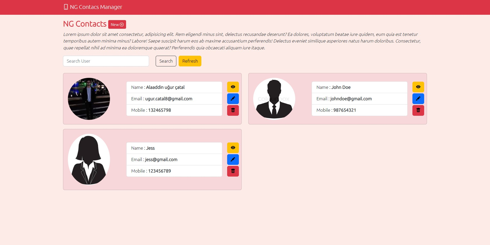

# ContactMgr

This project was generated with [Angular CLI](https://github.com/angular/angular-cli) version 15.0.3.

## Development server

Run `ng serve` for a dev server. Navigate to `http://localhost:4200/`. The application will automatically reload if you change any of the source files.

For use db.json you need to access server file and write on terminal  "npm start" it will start on localhost:9000
open terminal write cd and drop server file and run "npm start";
